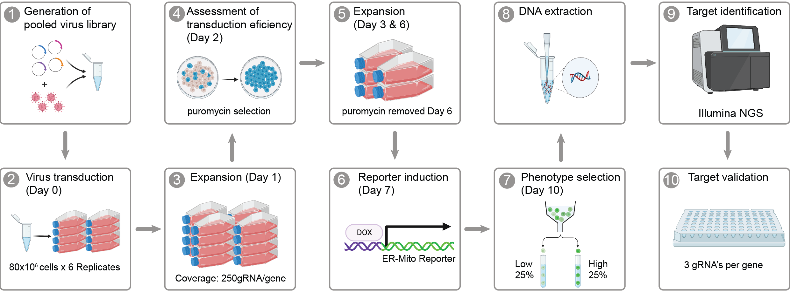

## Repository for our work titled "Genome-Wide CRISPR/Cas9 Screen shows that inhibiting GET4 is neuroprotective and increases mitochondrial-endoplasmic reticulum contact sites"

Authors: Emma L Wilson, Yizhou Yu, Nuno Santos Leal, James Woodward, Nikolaos Patikas, Sarah Field, Jordan L Morris, Yusuf Adia, Will Plumbly, Suvagata R Chowdhury, Vincent Paupe, Phillip R Antrobus, Georgia E Lindop, Samantha H. Y. Loh, Julien Prudent, L. Miguel Martins, Emmanouil Metzakopian

## Abstract  

Organelles form contacts between each other allowing for transfer of molecules and signals. Mitochondria-ER Contact sites (MERCS) are lengths of the Mitochondria and ER membrane which come together but do not fuse. They have been implicated in many diseases, including neurodegenerative, metabolic, and cardiac disease. MERCS have been highly researched, however, a lot is still left to explore. To uncover novel regulators of MERCS we conducted a genome-wide, flow cytometry-based screen using an engineered MERCs reporter cell line. We found 410 genes whose downregulation promotes MERCS and 230 genes whose downregulation decreases MERCS. From these, 29 genes were selected from each population for arrayed screening. 14/29 validated from the higher population and 7/29 from the low population. GET4 and BAG6 were highlighted as the top 2 genes that upon suppression increase MERCS from both the pooled and arrayed screen, and were subjected to further investigation. Loss of GET4 or BAG6  increased mVenus puncta, Proximity Ligation Assay (PLA) puncta and increased the percentage of ER in contact with mitochondria. In addition, GET4 and BAG6 were observed to interact with known MERCS proteins, inositol 1,4,5-trisphosphate receptors (IP3R) and Glucose-regulated protein 75 (GRP75). In addition, we found that loss of GET4 increased Calcium concentration [Ca2+] in the mitochondria and mitochondrial respiration. Finally, we show that loss of GET4 rescues motor ability, neurodegeneration and improves lifespan in a Drosophila model of Alzheimer's Disease (Aβ42Arc). Together, these results suggest that GET4 is involved in decreasing MERCS and that its loss is neuroprotective. 

## Index of analyses

### Figure 1 - Functional characterisation of an ER-Mito reporter cell line 

This folder contains supplementary data.

- Link: [Supplementary data](https://github.com/M1gus/MitoER-CRISPR-Screen/tree/main/Suplementary%20Tables)

### Figure 2 - CRISPR-Cas9 screening identified key genes involved with protein integration into the ER membrane.

This folder contains interactive plots of the results from the CRISPR-Cas9 screen

- Link: [Upregulators of MERCS](upregulators.html)
- Link: [Downregulators of MERCS](downregulators.html)

### List of all supplemetary tables

- Link: [Supplementary data](https://github.com/M1gus/MitoER-CRISPR-Screen/tree/main/Suplementary%20Tables)

##### Supplementary Table 1: Whole genome pooled library
A table showing the sequence and relevant information for all gRNAs used in the whole genome pooled screen. (a) Chromosome number of the giRNA targets, (b) gRNA start position in the genome, (c) gRNA end position in the genome, (d) DNA strand gRNA targeting, (e) gRNA DNA sequence forwards strand, (f) PAM sequence, (g) gRNA DNA sequence on reverse strand, (h) gene name/identifier, and (i) exon identifier.

##### Supplementary Table 2: Analysis of whole-genome pooled CRISPR/Cas9 screen
A table showing the results of the whole-genome pooled screen displayed by genes (sheet 1) or gRNAs (sheet 2). (a) gRNA identifier, (b) gene name, (c) total number of gRNAs per gene (5 gRNAs per gene per replica (5x6 = 30), (d) score for gRNAs enriched in the population which had a decrease in MedFI, (e) p value for gRNAs enriched in the population which had a decrease in MedFI, (f) false discovery rate for gRNAs enriched in the population which had a decrease in MedFI, (g) rank for gRNAs enriched in the population which had a decrease in MedFI, (h) number of different gRNA;s that were found to be enriched in population which had a decrease in MedFI, (i) Log fold change of gRNAs enriched in the population which had an increase in MedFI, (j) score for gRNAs enriched in the population which had an increase in MedFI, (k) p value for gRNAs enriched in the population which had an increase in MedFI, (l) false discovery rate for gRNAs enriched in the population which had an increase in MedFI, (m) rank for gRNAs enriched in the population which had an increase in MedFI, (n) number of different gRNA;s that were found to be enriched in population which had an increase in MedFI, and (o) Log fold change of gRNAs enriched in the population which had an increase in MedFI

##### Supplementary Table 3: The Arrayed gRNA Library
This table shows the DNA sequences for the arrayed library used in this study. (a) Gene name, (b) gRNA identifier in WG library, (c) forwards DNA sequence of gRNA including complementary overhangs (lowercase) for BFP puro backbone cut with BBS1, and (d) reverse DNA sequence of gRNA including complementary overhangs (lowercase) for BFP puro backbone cut with BBS1.

##### Supplementary Table 4: IP-Mass Spectrometry results investigating interactors of GET4 or BAG6.

##### Supplementary Table 5: Interactors of GET4
Table of gene names (a) with p values (b) and the difference in fold change compared to control. Those that overlap with MERCS proteins are stated in Column (d) and highlighted in bold. Those proteins that overlap with BAG6 interactors are stated in Column (e) and underlined.

##### Supplementary Table 6: Interactors of BAG6
Table of gene names (a) and the difference in fold change compared to control (b). Those that overlap with MERCS proteins are stated in Column (c) and highlighted in bold. Those proteins that overlap with GET4 interactors are stated in Column (d) and underlined.

##### Supplementary Table 7: siRNAs used in this study

##### Supplementary Table 8: Antibodies used in this study
